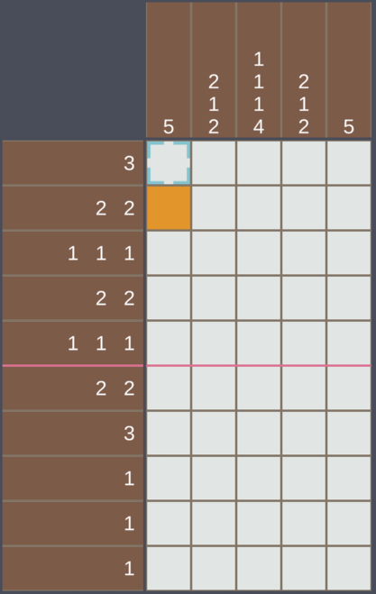

  

# 🤍 Hi, I'm Ruby Hsieh (Ruby1297)

## About Me

🎓 I’m a senior majoring in Computer Science and Information Engineering, currently learning about AI, computer vision, and XR.  

  
🖥️ Seeking internship opportunities in Taiwan related to computer science, computer vision, or HCI (Human–Computer Interaction).  

  
📫 Reach me through the contact links below.

  
  
  

## 📊 Tech Stack

### Languages  

### Frameworks · Cloud · Libraries  

---

## 🛠 Featured Projects

| Year | Project | Tech | Brief |
|------|---------|------|-------|
| 2024 | **[AI-based Multimodal Mental Health Chatbot](https://github.com/ruby1297/Mobile-Application-Programming-Final-Project)** | Python · LLM · LINE Bot | Integrates text / voice / image to detect emotions and give real-time feedback. |
| 2024 | **[Classroom Behavior Analysis & Cheating Prevention](https://github.com/ruby1297/Classroom-Behavior-Analysis-and-Cheating-Prevention-System)** | TensorFlow · OpenCV · React | Face-ID attendance on Raspberry Pi & Jetson Nano, gaze tracking + real-time dashboard. |

## 🧩 Play Time

Click the button below to play my favorite logic puzzle — **Nonogram**!

## 🧮 GitHub Summary

---

   Thanks for visiting my github🩵 • Last updated on 2025-08-08

